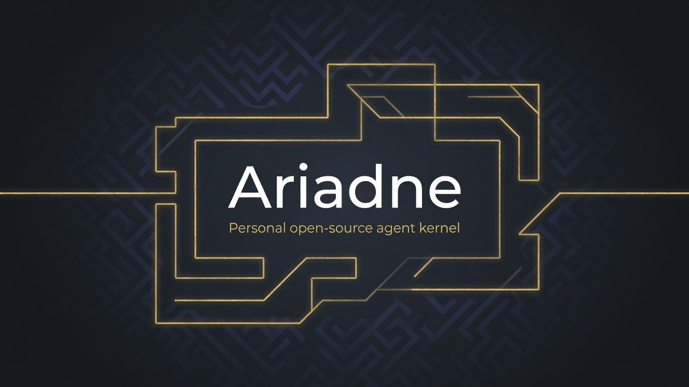
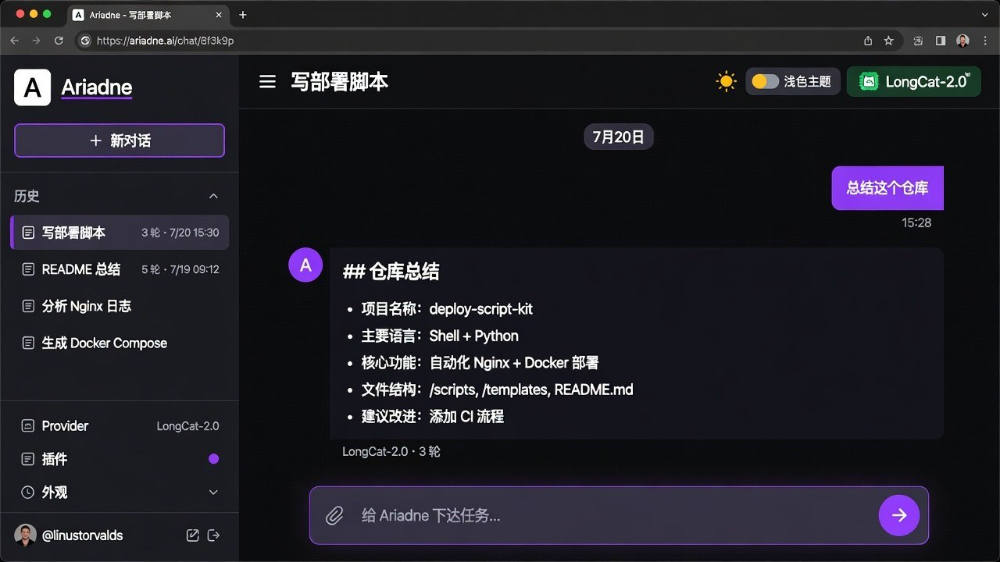
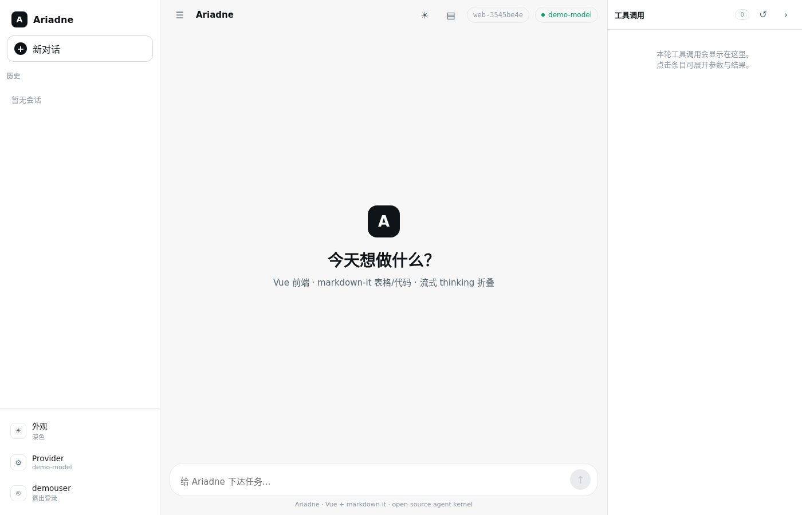
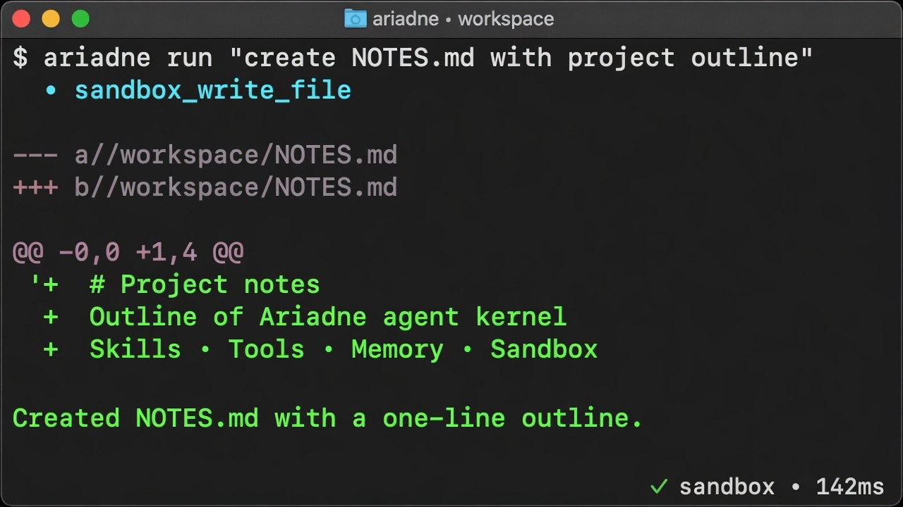

<p align="center">
  
</p>

<h1 align="center">Ariadne</h1>

<p align="center">
  <strong>Personal open-source agent kernel</strong><br/>
  Skills as the thread · Tools as the maze · Memory as the map you keep
</p>

<p align="center">
  <strong>English</strong> ·
  <a href="README.zh-CN.md">简体中文</a>
</p>

<p align="center">
  <a href="#quick-start"></a>
  <a href="https://www.python.org/downloads/"></a>
  <a href="docs/ROADMAP.md"></a>
  <a href="docs/"></a>
  <a href="#license"></a>
</p>

<p align="center">
  <a href="#quick-start">Quick start</a> ·
  <a href="#features">Features</a> ·
  <a href="#hosts--ui">Hosts &amp; UI</a> ·
  <a href="#usage">Usage</a> ·
  <a href="#architecture">Architecture</a> ·
  <a href="#documentation">Docs</a>
</p>

---

**Ariadne** is a callable runtime that turns one user turn into model reasoning, skill guidance, tool calls, layered memory, and **Docker-isolated** execution (Codex-style containers on *your* machine).

Default human interface: a **CLI shell agent** over your project workspace (bare `ariadne` → REPL).  
Optional: **Atelier** project workshops (`ariadne atelier`) and a **Grok-style Vue web UI** (`ariadne serve`) — history · chat · tools panel · workspace browser.

It is **not** an enterprise multi-tenant platform, connector hub, or company packaging stack.

```text
Your prompt
  → memory context assembly
  → skill discovery / load
  → one capability registry + tool loop
  → Docker sandbox (/workspace durable · /session scratch · network none)
  → persist transcript / state / result
```

## Screenshots

<p align="center">
  
</p>
<p align="center"><sub><b>Web (dark)</b> — left history · main chat · <b>right tools panel</b> · bottom composer · theme / model chips</sub></p>

<table>
  <tr>
    <td width="50%">
      
      <p align="center"><sub><b>Web (light)</b> — same three-column shell · light theme</sub></p>
    </td>
    <td width="50%">
      
      <p align="center"><sub><b>CLI</b> — bare <code>ariadne</code> REPL · tools · diffs · <code>/title</code> · <code>/image</code></sub></p>
    </td>
  </tr>
</table>

## Why Ariadne

Most “agent frameworks” give you either a thin chat wrapper, or a company platform full of connectors and deployment packs.

| You want | Ariadne gives you |
| --- | --- |
| **Callable agent** | `await agent.run(...)` / CLI turn execution |
| **Skills** | On-demand procedural guidance + compact selection plan |
| **Toolcall** | **One** capability registry, deferred schemas, audited loop |
| **Memory** | Layered recall + curated facts + conversation state |
| **Sandbox** | **Docker-first** hardened container (optional `local` / `null`) |
| **Atelier** | Project workshop: shared workspace + `KNOWLEDGE.md` + main/branch sessions |
| **Host UX** | Terminal agent + Vue web UI + workspace browser + plugins |

## Features

- **CLI first** — bare `ariadne` enters interactive REPL; `run` / `exec` one-shot; streaming, rich diffs, approvals
- **Docker-first sandbox** — default `ARIADNE_SANDBOX=docker`: cap-drop ALL, `--network none`, memory/CPU/pids limits, non-root, read-only rootfs; official image `ariadne-sandbox:minimal`
- **Semantic tools first** — prefer `sandbox_read_file` / `write` / `edit` / `list_dir`; `sandbox_exec` is a policy-gated shell fallback; **`web_fetch`** runs on the **host** (egress allowlist) so the container stays offline by default
- **Runtime agent (in-process)** — command allow/deny + secret redaction + audit JSONL (not a side daemon)
- **Atelier (工坊)** — `ariadne atelier`: project workshop with shared code tree, `KNOWLEDGE.md`, main session (zero ceremony), optional **branch** sessions (conversation isolation ≠ git)
- **Sessions** — continue / resume; **topic titles** (auto after each turn + `/title` or click web top-bar title)
- **Images** — CLI `/image` (path or clipboard); web paste / drag-drop; fails clearly if model is not multimodal (`ARIADNE_VISION`)
- **Memory L0–L4** — transcript, summaries, curated facts, semantic recall, L2 conversation state; optional consolidation → L3
- **Skills** — packs, hybrid search, section load, optional discriminators, scored selection plan
- **Guardrails** — secret redaction in/out; injection warnings; durable approval grants (on-request)
- **Official plugins** — GitLab / Redmine / Odoo as **user attributes** (secrets shown as `***`)
- **Web UI (Vue 3)** — three-column shell: history · chat · tools; **workspace browser** (project / per_user); markdown-it GFM tables; thinking collapse; turn stats; inline workspace 走势图
- **OpenAI-compatible models** — chat completions + tools + optional reasoning stream

## Hosts & UI

### CLI shell (default)

```bash
ariadne                 # interactive REPL (active_session, stream on)
ariadne "do the thing"  # REPL + first user turn
ariadne run "…"         # non-interactive one-shot
ariadne exec "…"        # alias of run
```

Useful in-REPL commands: `/help`, `/title`, `/image`, `/resume`, `/status`, `/mode`, `/exit`.

### Atelier — project workshop

A **Codex-like project room**: shared code tree, continuous main chat, optional experiment branches, and a living `KNOWLEDGE.md`.

```text
Atelier = workshop
├── workspace/       shared code (all sessions see the same files)
├── KNOWLEDGE.md     project knowledge wall (decisions, conventions)
├── Main session     daily continuous dialogue (zero ceremony)
└── Branch session*  isolated conversation + own sandbox scope
                     (not a git branch)
```

```bash
ariadne atelier create my-app --from .     # workshop from existing code
ariadne atelier open my-app                # REPL on main (shared workspace)
ariadne atelier branch create my-app exp   # experiment conversation
ariadne atelier branch merge my-app exp    # summary → KNOWLEDGE + notify main
ariadne atelier knowledge show my-app
```

Design: [docs/design/atelier.md](docs/design/atelier.md).

### Docker sandbox (default)

Default backend is **Docker** (self-hosted Codex-style isolation). Escape hatch for CI/dev without isolation:

```bash
ariadne --sandbox local     # unisolated host workdir
ariadne --sandbox null      # no exec
```

```bash
# Build the official minimal image (bash/git/curl + non-root user)
./scripts/build_sandbox_image.sh
# → ariadne-sandbox:minimal

ariadne doctor              # docker OK? image present?
```

| Default | Value |
| --- | --- |
| Network | `--network none` (HTTP via host `web_fetch` + egress allowlist) |
| Caps | `--cap-drop ALL`, `no-new-privileges` |
| Resources | 512m / 0.5 CPU / 128 PIDs (profile-tunable) |
| FS | `/workspace` bind project · `/session` scratch · optional read-only rootfs |

Details: [docs/SANDBOX.md](docs/SANDBOX.md) · [docs/design/sandbox-v1.md](docs/design/sandbox-v1.md).

### Web UI (Vue)

```bash
ariadne serve --host 127.0.0.1 --port 8420
# → http://127.0.0.1:8420
```

| Area | Behavior |
| --- | --- |
| **Left sidebar** | **历史 \| 工作区** tabs · session titles · appearance / Provider / plugins |
| **Workspace browser** | Codex-style tree under `/workspace` (`project` or `per_user` mode) |
| **Main column** | Top bar · chat · composer · thinking collapse · turn stats |
| **Right tools panel** | Collapsible · per-call detail · duration / tokens / tool count |
| **Markdown** | markdown-it GFM tables · workspace image inline (走势图) |

```bash
cd frontend && npm ci && npm run build:fast
cd frontend && npm run dev                   # proxies /api → :8420
```

## Quick start

### 1. Prerequisites

- **Python 3.13+**
- **Docker** (daemon running) for the default sandbox  
  Without Docker: `ariadne --sandbox local` (no isolation)

### 2. Install

```bash
git clone <your-fork-or-url>/Ariadne.git
cd Ariadne
python3 -m venv .venv && source .venv/bin/activate   # recommended
python3 -m pip install -e ".[dev]"
./scripts/build_sandbox_image.sh                     # ariadne-sandbox:minimal
```

### 3. Configure an OpenAI-compatible LLM

```bash
cp .env.example .env
```

```bash
# .env — never commit this file
BASE_URL=https://api.longcat.chat/openai/v1
API_KEY=sk-...
MODEL=LongCat-2.0
# optional:
# ARIADNE_SANDBOX=docker          # default
# ARIADNE_SANDBOX_NETWORK=none
# ARIADNE_EGRESS_ALLOWED=api.github.com,example.com
# ARIADNE_VISION=auto|on|off
```

### 4. Run

```bash
ariadne doctor
ariadne
ariadne atelier create demo --from .
ariadne serve --port 8420
```

```bash
python -m pytest -q
```

Full host guide: **[docs/USAGE_CLI.md](docs/USAGE_CLI.md)** · **[docs/zh/USAGE_CLI.md](docs/zh/USAGE_CLI.md)**.

## Usage

### CLI cheatsheet

```bash
ariadne
ariadne "create NOTES.md with a one-line outline"
ariadne run "summarize README.md"
ariadne -c                      # continue last session
ariadne resume --last
ariadne sessions
ariadne doctor                  # docker + image + provider
ariadne plugins
ariadne plugin enable gitlab --url … --token …

# Atelier
ariadne atelier create my-app --from .
ariadne atelier open my-app
ariadne atelier branch create my-app jwt-vs-session
ariadne atelier branch merge my-app jwt-vs-session
ariadne atelier knowledge show my-app

# in REPL:
#   /title 部署脚本     /title --refresh
#   /image ./shot.png   /image          # clipboard
#   /help /status /exit
```

### Python API (shape)

```python
from ariadne.config import load_settings
from ariadne.host.compose import compose_agent

agent = compose_agent(load_settings())
result = await agent.run("Summarize this repo and open a short TODO list")
print(result.text)
```

See [docs/PUBLIC_API.md](docs/PUBLIC_API.md).

## Architecture

```text
┌──────────────────────────────────────────────────────────────────┐
│  Hosts                                                            │
│   CLI REPL  ·  Atelier workshop  ·  Web (serve)  ·  library      │
└──────────────────────────────┬───────────────────────────────────┘
                               ▼
┌──────────────────────────────────────────────────────────────────┐
│  TurnApplication — memory · skill plan · tool loop                │
│    ├─ Memory L0–L4 · optional consolidation → L3                 │
│    ├─ SkillStore (selection plan · section load)                 │
│    ├─ ToolRegistry (semantic file tools · web_fetch · shell)     │
│    ├─ RuntimeAgent (in-process policy · audit · egress)        │
│    ├─ Model (OpenAI-compatible + optional vision)                │
│    └─ Sandbox port → Docker (default) / local / null             │
│         hardened container · /workspace · /session · net none    │
└──────────────────────────────────────────────────────────────────┘
```

**Design pillars:** one registry · skills ≠ tools · layered memory · deferred detail · fastfail · sandbox as a port · **Docker-first personal isolation** · project workshop (Atelier) as host UX.

## Documentation

| Doc | Topic |
| --- | --- |
| [README.zh-CN.md](README.zh-CN.md) | 中文介绍 |
| [docs/USAGE_CLI.md](docs/USAGE_CLI.md) · [docs/zh/USAGE_CLI.md](docs/zh/USAGE_CLI.md) | Host usage |
| [docs/design/atelier.md](docs/design/atelier.md) | **Atelier** workshop (main/branch + KNOWLEDGE) |
| [docs/design/sandbox-v1.md](docs/design/sandbox-v1.md) · [docs/SANDBOX.md](docs/SANDBOX.md) | **Docker-first** sandbox |
| [docs/design/web-workspace.md](docs/design/web-workspace.md) | Web workspace modes (project / per_user) |
| [docs/design/web-vue-frontend.md](docs/design/web-vue-frontend.md) | Vue web UI + markdown-it stack |
| [docs/ACCEPTANCE.md](docs/ACCEPTANCE.md) | Acceptance matrix → tests |
| [docs/VISION.md](docs/VISION.md) · [ARCHITECTURE.md](docs/ARCHITECTURE.md) · [PUBLIC_API.md](docs/PUBLIC_API.md) | Design core |
| [docs/SKILLS.md](docs/SKILLS.md) · [TOOLCALL.md](docs/TOOLCALL.md) · [MEMORY.md](docs/MEMORY.md) | Subsystems |
| [docs/ROADMAP.md](docs/ROADMAP.md) | Delivery checklist |

## Non-goals

- Company Packs / multi-company deployment models  
- First-class WeCom / Feishu / Telegram / Slack product surface  
- Multi-tenant SaaS control planes  
- Silent compatibility fallbacks  

Official optional plugins (GitLab / Redmine / Odoo) are user-configured integrations — not multi-company packs. See [docs/NON_GOALS.md](docs/NON_GOALS.md).

## Project layout

```text
src/ariadne/                 kernel, memory, tools, skills, sandbox, atelier, CLI, web
src/ariadne/atelier/         project workshop (manager, knowledge, runner)
src/ariadne/sandbox/         Docker-first port + RuntimeAgent + policy
src/ariadne/web/static/dist/ Vue production build
frontend/                    Vue 3 + Vite source
docker/sandbox/              official minimal sandbox Dockerfile
scripts/                     build_sandbox_image.sh, verify_web.py, …
skills/builtin/              example skill packs
tests/                       offline pytest suite
docs/design/atelier.md       Atelier design
docs/design/sandbox-v1.md    sandbox contract
docs/assets/                 README images
```

## Name

In myth, **Ariadne** gave Theseus a thread to escape the labyrinth.  
Here the labyrinth is multi-step tool use; the thread is skills + disciplined tool exposure; memory is what you keep so the next turn does not start blind.

## Origin note

Ariadne reinterprets ideas proven inside a private production agent core (skills runtime, deferred tool schemas, multi-layer memory). It is a **new personal open-source project**, not a fork of that platform’s company packaging or connectors.

## License

License to be chosen at first public release. Documentation and design may be used for discussion now.

---

<p align="center">
  <sub>Built for developers who want a real agent kernel — not another chat wrapper.</sub>
</p>
